**[Explorar projetos](https://github.com/DEV-Julio-Cesar?tab=repositories) · [ERP para padarias](https://github.com/DEV-Julio-Cesar/Padaria-em-teste-python-java) · [Gestão de contatos](https://github.com/DEV-Julio-Cesar/Desafio-Dev-Julio-Cesar)**

`TypeScript` · `React` · `Node.js` · `C#` · `.NET` · `SQL`

## Olá, eu sou o Julio 👋

Meu portfólio reúne aplicações web, sistemas de gestão e atividades de desenvolvimento. Aqui compartilho projetos que integram frontend, backend e persistência de dados, com experiências nos ecossistemas JavaScript/TypeScript e C#/.NET.

## Projetos em destaque

### 🥖 ERP para padarias

Sistema de gestão e frente de caixa com módulos de vendas, estoque, compras, produção e relatórios. A documentação também apresenta controle de acesso, auditoria e continuidade da operação sem internet.

**Tecnologias:** React · TypeScript · Node.js · Express · Prisma · PostgreSQL

[Ver projeto e documentação →](https://github.com/DEV-Julio-Cesar/Padaria-em-teste-python-java)

### 📇 Gestão de contatos

Aplicação full stack para cadastro e consulta de contatos, com filtros, paginação e operações de criação, edição e exclusão. Integra uma interface Angular a uma API ASP.NET Core e ao SQL Server.

**Tecnologias:** C# · ASP.NET Core · Angular · SQL Server · ADO.NET

[Ver projeto e instruções de execução →](https://github.com/DEV-Julio-Cesar/Desafio-Dev-Julio-Cesar)

## Tecnologias presentes nos projetos

| Área | Tecnologias |
| --- | --- |
| Frontend | React, Angular, TypeScript, JavaScript e HTML |
| Backend | Node.js, Express, C# e ASP.NET Core |
| Dados | PostgreSQL, SQL Server, Prisma e ADO.NET |
| Ferramentas e execução | Git, GitHub, Vite e Docker Compose |

## Outros trabalhos

- [Sistema de Treinamento Inclusivo](https://github.com/DEV-Julio-Cesar/Sistema-de-Treinamento)
- [Atividades e Projetos UC9](https://github.com/DEV-Julio-Cesar/Atividades-e-Projetos-UC9)
- [Todos os repositórios](https://github.com/DEV-Julio-Cesar?tab=repositories)

---

**Explore os repositórios para conhecer o código, as tecnologias e as instruções de cada projeto.**

